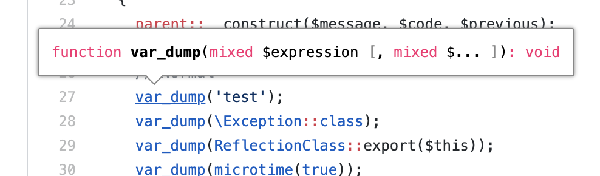
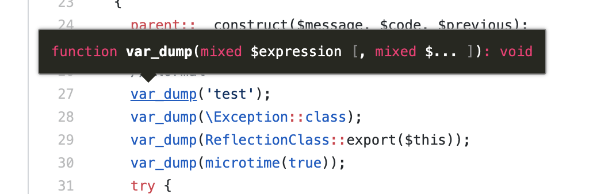
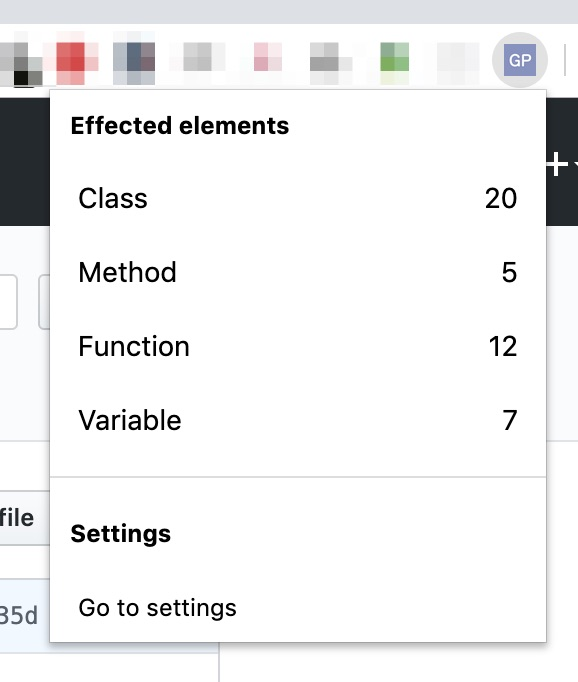
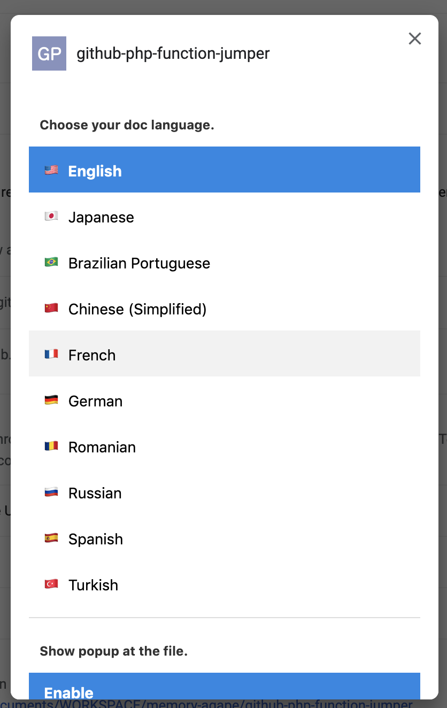

# What is this?
This Chrome Extension allows you to jump to the PHP Manual from php functions and classes on your GitHub source codes and discussion.

# Chrome Web Store
You can download here!
- https://chrome.google.com/webstore/detail/github-php-function-jumpe/pmgmgaejgbjiooiklinoelilmnldlhcf

# Supported services
- GitHub
- Gists
- GitHub for Enterprise

# Customize
## You can choose theme
- **White**

- **Dark**

## Popup
- You can understand which was effected elements.

# Setting
- You can set details options on extension setting screen. 

# Demo

# License
MIT

